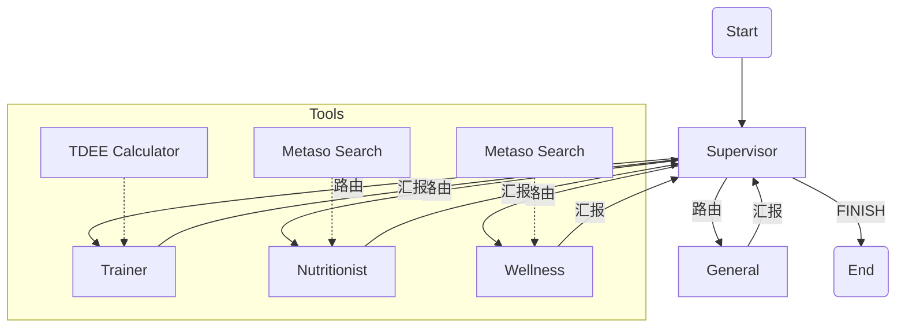

# Health Guide Agent

基于 LangGraph 的多智能体健康管理咨询系统。通过协作的方式，为用户提供训练、饮食和康复建议。

## 架构概览

系统包含一个 Supervisor（总监）和四个专家 Agent：

- **Trainer**: 制定训练计划，计算 TDEE。
- **Nutritionist**: 提供饮食建议，使用 Metaso 搜索食物热量。
- **Wellness**: 关注身心康复，使用 Metaso 搜索康复知识。
- **General**: 负责日常闲聊和通用问题。

### LangGraph 结构图



## 快速开始

1. **环境配置**

   创建 `.env` 文件并填入 API Key：

   ```ini
   SILICONFLOW_API_KEY=your_key
   SILICONFLOW_MODEL=Qwen/Qwen2.5-14B-Instruct # 或其他硅基流动支持的模型
   METASO_API_KEY=your_key
   ```

2. **配置用户画像**

   修改 `health_guide/config.py` 中的 `USER_PROFILE`，填入您的个人信息（身高、体重、伤病史等），以便 Agent 提供个性化的建议。

3. **安装依赖**

   ```bash
   pip install -r requirements.txt
   ```

4. **运行**

   ```bash
   python main.py
   ```

## 目录结构

```
Health Guide/
├── main.py                 # 入口文件
├── health_guide/          
│   ├── agents/             # 专家 Agent 定义
│   │   ├── supervisor.py
│   │   ├── trainer.py
│   │   ├── nutritionist.py
│   │   └── wellness.py
│   ├── graph.py            # LangGraph 构建
│   ├── tools.py            # 工具 (Metaso, TDEE)
│   ├── llm.py              # LLM 配置 (SiliconFlow/GLM)
│   ├── config.py           # 用户画像配置
│   └── ...
└── ...
```
